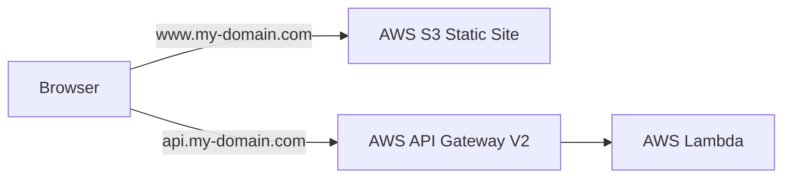

This walkthrough shows how to use Rust on an AWS Lambda handling requests from AWS API Gateway V2, ostensibly to serve as the backend for a client application served through AWS S3 or AWS CloudFront. The AWS API Gateway V2 and static site in AWS S3 are connected to real domain names managed by AWS Route53. The overall architecture provides an inexpensive, highly-scalable infrastructure for web services, costing a few cents a month for the seldom used to hundreds for the heavily trafficked. This is all constructed and deployed with the AWS Cloud Development Toolkit, or CDK.



Cloud resources represent an enormous opportunity for hackers, as "free" data storage, compute, and simply mining your customer's data. Rust's strong consistency and security guarantees make it a challenging target for criminals to exploit as a vector into your cloud. In addition to security, Rust presents a particularly strong presence as the language of implementation for a Lambda, where execution speed translates directly into cost savings as billing is calculated by the millisecond, prorated to the nearest ten.

This guide requires the following already be installed and configured:

- The Rust Programming Language.
- A NodeJS interpreter. You need to be able to install NodeJS packages globally (`npm i -g` must not fail).
- A Docker runtime, and you must be privileged to run containers on it (`docker run --rm -it amazonlinux:latest bash -c 'yum install -y cowsay && cowsay Moo!'` should not fail).

> If you don't want to follow along manually you can get started quickly with the end-product of this guide at [this template](https://github.com/mysteriouspants/rocket-on-lambdas-starter-template) - just create a new repository from the template, fill in some of the variables, and you're good to go! You might still scan through this guide to see some of the rationale behind the decisions made if you're not familiar with the technologies used.

## Get Started with AWS

Get an AWS Account. Do the sensible thing, put MFA on the root account, create a new IAM user for yourself and use that instead (with MFA). Configure your local AWS CLI. Remember to rotate your keys regularly, I recommend putting a recurring appointment on your personal calendar to do so!

```
xpm@mysteriousnotebook ~/C> sudo apt-get install -y awscli
xpm@mysteriousnotebook ~/C> mkdir ~/.aws
xpm@mysteriousnotebook ~/C> cat << 'EOF' >> ~/.aws/credentials
[default]
aws_access_key_id=...
aws_secret_access_key=...
EOF
xpm@mysteriousnotebook ~/C> chmod go-rwx ~/.aws/credentials
xpm@mysteriousnotebook ~/C> cat << 'EOF' >> ~/.aws/config
[default]
region=us-west-1
output=json
EOF
```

Test that it works by hitting SSM Parameter Store, which requires credentials.

```
xpm@mysteriousnotebook ~/C> aws ec2 describe-images \
  --owners 137112412989 \
  --image-ids $(aws ssm get-parameters \
    --names /aws/service/ami-amazon-linux-latest/amzn2-ami-hvm-arm64-gp2 \
    | jq -r '.Parameters[0].Value') \
  | jq -r '.Images[0].Name'
amzn2-ami-hvm-2.0.20210701.0-arm64-gp2
```

Your AWS CLI is now configured. On to CDK.

## Install CDK

```
xpm@mysteriousnotebook ~> npm i -g typescript aws-cdk@1.116.0
xpm@mysteriousnotebook ~> asdf reshim # if using asdf
xpm@mysteriousnotebook ~> cdk --version
```

Bootstrap CDK in your account. This will create some buckets and roles so that CDK can work with CloudFormation in your account.

> AWS CloudFormation is a way of managing groups of related resources, called "Stacks." CDK is a programmatic way of creating CloudFormation Stack definitions, uploading them to AWS CloudFormation, and having that create the resources described in the Stack.

```
xpm@mysteriousnotebook ~> cdk bootstrap aws://${AWS_ACCOUNT}/us-west-1
 ⏳  Bootstrapping environment aws://_/us-west-1...
CDKToolkit: creating CloudFormation changeset...
 ✅  Environment aws://_/us-west-1 bootstrapped.
xpm@mysteriousnotebook ~> aws cloudformation \
  describe-stack-resources --stack-name CDKToolkit
{
    "StackResources": [
        {
            "StackName": "CDKToolkit",
            "StackId": "arn:aws:cloudformation:us-west-1:_:stack/CDKToolkit/_",
            "LogicalResourceId": "StagingBucket",
            "PhysicalResourceId": "cdktoolkit-stagingbucket-_",
            "ResourceType": "AWS::S3::Bucket",
            "Timestamp": "2021-07-14T05:09:11.999Z",
            "ResourceStatus": "CREATE_COMPLETE",
            "DriftInformation": {
                "StackResourceDriftStatus": "NOT_CHECKED"
            }
        },
        {
            "StackName": "CDKToolkit",
            "StackId": "arn:aws:cloudformation:us-west-1:_:stack/CDKToolkit/_",
            "LogicalResourceId": "StagingBucketPolicy",
            "PhysicalResourceId": "CDKToolkit-StagingBucketPolicy-_",
            "ResourceType": "AWS::S3::BucketPolicy",
            "Timestamp": "2021-07-14T05:09:14.829Z",
            "ResourceStatus": "CREATE_COMPLETE",
            "DriftInformation": {
                "StackResourceDriftStatus": "NOT_CHECKED"
            }
        }
    ]
}
```

Now create a project. I'm calling mine Pax Imperia, after a domain name that I bought some time ago and have lying around unused, perfect for experimenting with!

```
xpm@mysteriousnotebook ~> mkdir Code/pax-imperia.com
xpm@mysteriosunodebook ~/C> cd Code/pax-imperia.com
xpm@mysteriousnotebook ~/C/pax-imperia.com> git init
xpm@mysteriousnotebook ~/C/pax-imperia.com> git branch -m mainline
xpm@mysteriousnotebook ~/C/pax-imperia.com> mkdir cdk && pushd cdk
xpm@mysteriousnotebook ~/C/p/cdk> cdk init app --language typescript
Applying project template app for typescript
# Welcome to your CDK TypeScript project!

This is a blank project for TypeScript development with CDK.

The `cdk.json` file tells the CDK Toolkit how to execute your app.

## Useful commands

 * `npm run build`   compile typescript to js
 * `npm run watch`   watch for changes and compile
 * `npm run test`    perform the jest unit tests
 * `cdk deploy`      deploy this stack to your default AWS account/region
 * `cdk diff`        compare deployed stack with current state
 * `cdk synth`       emits the synthesized CloudFormation template

Executing npm install...
npm WARN deprecated urix@0.1.0: Please see https://github.com/lydell/urix#deprecated
npm WARN deprecated resolve-url@0.2.1: https://github.com/lydell/resolve-url#deprecated
npm WARN deprecated sane@4.1.0: some dependency vulnerabilities fixed, support for node < 10 dropped, and newer ECMAScript syntax/features added
✅ All done!
```

Next we'll install some dependencies, which are the pieces of the CDK library describing the tools we'll be using.

- aws-lambda is a "serverless" code execution engine. When your code needs to be executed it creates a small micro-virtual machine to run it; when there are no more requests, this micro-vm can be reaped. As a result you only pay for the time that it is actually in use - idle lambdas are completely free.
- aws-api-gatewayv2 is a configurable proxy which can route HTTP traffic, in our case to a Lambda via the Lambda integration.
- aws-logs allows us to configure the way the logs generated by the Lambda are retained. Lambda by default sends logs and metrics to CloudWatch, which gives you rich insights into how your service is running. CloudWatch logs cost money to retain, so let's reduce that down to a more sensible retention period.

```
xpm@mysteriousnotebook ~/C/p/cdk> npm i \
  @aws-cdk/aws-{lambda,api-gatewayv2,api-gatewayv2-integrations,aws-logs}@1.116.0
xpm@mysteriousnotebook ~/C/p/cdk> popd
```

Now you have an empty CDK Stack at `cdk/lib/cdk-stack.ts`.

```typescript
import * as cdk from '@aws-cdk/core';

export class CdkStack extends cdk.Stack {
  constructor(scope: cdk.Construct, id: string, props?: cdk.StackProps) {
    super(scope, id, props);

    // The code that defines your stack goes here
  }
}
```

Let's customize it a little bit and add some custom properties to define the domain names that our website will use. If you're not familiar with typescript, what we're saying here is that the props property must be supplied and must have the attributes of `CustomStackProps` and the `cdk.StackProps` it originally had. We remove the `?` to indicate that this can no longer be `undefined`. By working with TypeScript we can catch many kinds of misconfiguration right in the editor with the language server (or at build time), saving time.

```typescript
import * as cdk from '@aws-cdk/core';

export interface CustomStackProps {
  domainName: string,
  wwwRecordName: string,
  apiRecordName: string,
}

export class CdkStack extends cdk.Stack {
  constructor(
      scope: cdk.Construct,
       id: string,
       props: cdk.StackProps & CustomStackProps
  ) {
    super(scope, id, props);
    
    // The cloud is your oyster
  }
}
```

This will cause an error in `cdk/bin/cdk.ts` which can be remedied by specifying the attributes I just mentioned, like so, although I'm using a domain name that I have control over. You can substitute one of your own.

```typescript
#!/usr/bin/env node
import 'source-map-support/register';
import * as cdk from '@aws-cdk/core';
import { CdkStack } from '../lib/cdk-stack';

const app = new cdk.App();
const [wwwRecordName, apiRecordName, domainName] = ['www', 'api', 'pax-imperia.com'];

new CdkStack(app, 'PaxImperiaInfaStack', {
  domainName, wwwRecordName, apiRecordName,
});
```

## Add Some Rust

Next up we need some Rust to put in a Lambda. Let's create that now.

```
xpm@mysteriousnotebook ~/C/pax-imperia.com> cargo new --bin api-lambda
     Created binary (application) `api-lambda` package
xpm@mysteriousnotebook ~/C/pax-imperia.com> pushd api-lambda
```

Immediately we need some new dependencies, and we'll name the output program `bootstrap`, which is the name of the program that Lambda will always run.

_Crates you should know!_

- [Rocket](https://github.com/SergioBenitez/Rocket) is a Rust web framework.
- [Lambda Web](https://github.com/hanabu/lambda-web) is an adapter that takes AWS API Gateway shapes and dispatches them to local request handlers implemented by Rust web frameworks, such as Rocket, Actix, or Warp. It's using the Lambda Runtime crate under the hood.

```
xpm@mysteriousnotebook ~/C/p/api-lambda> cat << 'EOF' > Cargo.toml
[package]
name = "api-lambda"
version = "0.1.0"
edition = "2018"
publish = false

[[bin]]
name = "bootstrap"
path = "src/main.rs"

[dependencies]
lambda-web = { version = "0.1", features=[ "rocket05" ] }
rocket = { version = "0.5.0-rc.1", features = [ "json" ] }
EOF
```

Let's put a stubbed-out program in `main.rs`.

```
xpm@mysteriousnotebook ~/C/p/api-lambda> cat << 'EOF' > src/main.rs
use lambda_web::{is_running_on_lambda, launch_rocket_on_lambda, LambdaError};
use rocket::{self, get, routes};

#[get("/hello/<name>")]
fn hello(name: &str) -> String {
    format!("Hello, {}!", name)
}

#[rocket::main]
async fn main() -> Result<(), LambdaError> {
    let rocket = rocket::build().mount("/", routes![hello]);
    if is_running_on_lambda() {
        // Launch on AWS Lambda
        launch_rocket_on_lambda(rocket).await?;
    } else {
        // Launch local server
        rocket.launch().await?;
    }
    Ok(())
}
EOF
xpm@mysteriousnotebook ~/C/p/api-lambda> popd
```

## Deploying a Rust Lambda

CDK can build and deploy our Lambda (yes, our Rust lambda!) for us. Update your infrastructure stack in CDK at `cdk/lib/cdk-stack.ts`.

Step by step, we specify our Rust version. CDK will build the binary for the lambda in a Docker container, so we have to specify the Rust version to pick the correct container. Next we specify the target toolchain, which for us is the musl variation of the Linux toolchain. MUSL breaks our dependency on a local glibc, as the Amazon Linux 2 microvm the Lambda is running will likely not have the same version of glibc that the Debian-derived Docker container has. Programs do strange things when run on versions of glibc they aren't expecting.

If you do need to back out of using MUSL for some reason, such as a dependency on OpenSSL you can't get out of, you can configure an Amazon Linux 2 Docker image (`amazonlinux:latest`) with the Rust toolchain and use that as a builder instead - it'll give you the same userspace as the microvm variant we select, so it'll work just fine.

Further down we create our API Gateway, backed by the Lambda. Specifying the V2 model version is important for the `lambda_web` crate, which doesn't work with the other V1 type.

```typescript
import * as cdk from '@aws-cdk/core';
import * as lambda from '@aws-cdk/aws-lambda';
import * as awslogs from '@aws-cdk/aws-logs';
import * as apigw from '@aws-cdk/aws-apigatewayv2';
import * as apigwi from '@aws-cdk/aws-apigatewayv2-integrations';

export interface CustomStackProps { /* ... */ }
export class CdkStack extends cdk.Stack {
  constructor(
    scope: cdk.Construct, id: string,
    props: cdk.StackProps & CustomStackProps
  ) {
    super(scope, id, props);

    const { wwwRecordName, apiRecordName, domainName } = props;
    const rustVersion = '1.53';
    const target = 'x86_64-unknown-linux-musl';
    const apiLambda = new lambda.Function(this, 'ApiHandler', {
      code: lambda.Code.fromAsset('../api-lambda', {
        bundling: {
          command: [
            'bash', '-c',
            `rustup target add ${target} && \
             cargo build --release --target ${target} && \
             cp target/${target}/release/bootstrap /asset-output/bootstrap`
          ],
          image: cdk.DockerImage.fromRegistry(`rust:${rustVersion}-slim`),
        }
      }),
      handler: 'main',
      runtime: lambda.Runtime.PROVIDED_AL2,
      logRetention: awslogs.RetentionDays.ONE_MONTH,
    });

    const apiGateway = new apigw.HttpApi(this, 'ApiEndpoint', {
      defaultIntegration: new apigwi.LambdaProxyIntegration({
        handler: apiLambda,
        payloadFormatVersion: apigw.PayloadFormatVersion.VERSION_2_0,
      }),
    });
  }
}
```

Run `cdk deploy` to put it into the cloud! CDK will build your lambda using Docker and then show you a table. This contains all the IAM Role grants you're about the deploy. It's a good idea to give this a study and make sure there isn't anything overly-broad or unexpected. For example, a general rule is that you should never have an `*` in your IAM Resource position - always narrow it to a specific service. Security is job zero!

```
xpm@mysteriousnotebook ~/C/pax-imperia.com> pushd cdk
xpm@mysteriousnotebook ~/C/p/cdk> cdk deploy
Bundling asset PaxImperiaInfaStack/ApiHandler/Code/Stage...
info: downloading component 'rust-std' for 'x86_64-unknown-linux-musl'
info: installing component 'rust-std' for 'x86_64-unknown-linux-musl'
    Updating crates.io index
 Downloading crates ...
  Downloaded parking_lot v0.11.1
  ...
  Downloaded encoding_rs v0.8.28
    Finished release [optimized] target(s) in 20.95s
This deployment will make potentially sensitive changes according to your current security approval level (--require-approval broadening).
Please confirm you intend to make the following modifications:

IAM Statement Changes
┌───┬───────────────────┬────────┬───────────────────┬───────────────────┬─────────────────────┐
│   │ Resource          │ Effect │ Action            │ Principal         │ Condition           │
├───┼───────────────────┼────────┼───────────────────┼───────────────────┼─────────────────────┤
│ + │ ${ApiHandler.Arn} │ Allow  │ lambda:InvokeFunc │ Service:apigatewa │ "ArnLike": {        │
│   │                   │        │ tion              │ y.amazonaws.com   │   "AWS:SourceArn":  │
│   │                   │        │                   │                   │ "arn:${AWS::Partiti │
│   │                   │        │                   │                   │ on}:execute-api:${A │
│   │                   │        │                   │                   │ WS::Region}:${AWS:: │
│   │                   │        │                   │                   │ AccountId}:${ApiEnd │
│   │                   │        │                   │                   │ pointA9C748C3}/*/*" │
│   │                   │        │                   │                   │ }                   │
├───┼───────────────────┼────────┼───────────────────┼───────────────────┼─────────────────────┤
│ + │ ${ApiHandler/Serv │ Allow  │ sts:AssumeRole    │ Service:lambda.am │                     │
│   │ iceRole.Arn}      │        │                   │ azonaws.com       │                     │
└───┴───────────────────┴────────┴───────────────────┴───────────────────┴─────────────────────┘
IAM Policy Changes
┌───┬───────────────────────────┬──────────────────────────────────────────────────────────────┐
│   │ Resource                  │ Managed Policy ARN                                           │
├───┼───────────────────────────┼──────────────────────────────────────────────────────────────┤
│ + │ ${ApiHandler/ServiceRole} │ arn:${AWS::Partition}:iam::aws:policy/service-role/AWSLambda │
│   │                           │ BasicExecutionRole                                           │
└───┴───────────────────────────┴──────────────────────────────────────────────────────────────┘
(NOTE: There may be security-related changes not in this list. See https://github.com/aws/aws-cdk/issues/1299)

Do you wish to deploy these changes (y/n)? y
PaxImperiaInfaStack: deploying...
[0%] start: Publishing b40974ec3d9d3ea078e23b4f5bc7d3804bef22ef24234f3af8306d7be9d114be:current
[100%] success: Published b40974ec3d9d3ea078e23b4f5bc7d3804bef22ef24234f3af8306d7be9d114be:current
PaxImperiaInfaStack: creating CloudFormation changeset...

 ✅  PaxImperiaInfaStack

Stack ARN:
arn:aws:cloudformation:us-west-1:_:stack/PaxImperiaInfaStack/c42c5f90-e5f6-11eb-af32-_
xpm@mysteriousnotebook ~/C/p/cdk> popd
```

Finally we can use Curl to test that our Lambda is working.

```
xpm@mysteriousnotebook ~/C/pax-imperia.com> curl \
  https://1cmn8nk2jh.execute-api.us-west-1.amazonaws.com/hello/xpm
Hello, xpm!%      
```

## A Static Website

While the main focus of this article is on Rust and AWS CDK, a critical component of the product stack is the static website that is vended to customers which uses the API Lambda. Here we shall use ReactJS, though you should feel free to substitute any other web stack you desire.

```
xpm@mysteriousnotebook ~/C/pax-imperia.com> npx create-react-app \
  react-website --template typescript
```

This gives us a basic React website to work with. The most interesting thing for the purpose of this walkthrough is that it can be built with the command `npm run build` and it places the built products into `react-website/build`.

```
xpm@mysteriousnotebook ~/C/p/react-website> npm run build

> react-website@0.1.0 build
> react-scripts build

Creating an optimized production build...
Compiled successfully.

File sizes after gzip:

  41.34 KB  build/static/js/2.d06a0c4f.chunk.js
  1.63 KB   build/static/js/3.44599fc6.chunk.js
  1.17 KB   build/static/js/runtime-main.c7bb1896.js
  596 B     build/static/js/main.71b8fcf2.chunk.js
  556 B     build/static/css/main.a617e044.chunk.css

The project was built assuming it is hosted at /.
You can control this with the homepage field in your package.json.

The build folder is ready to be deployed.
You may serve it with a static server:

  npm install -g serve
  serve -s build

Find out more about deployment here:

  https://cra.link/deployment
xpm@mysteriousnotebook ~/C/p/react-website> ls build
asset-manifest.json  index.html   logo512.png    robots.txt
favicon.ico          logo192.png  manifest.json  static
xpm@mysteriousnotebook ~/C/p/react-website> popd
```

## Deploying a Static Website

We can have CDK build and deploy the static website much the same way we had it build and deploy the Lambda. We'll first need some additional CDK features.

```
xpm@mysteriousnotebook > pushd cdk
xpm@mysteriousnotebook > npm i @aws-cdk/aws-s3{,-deployment}@1.116.0
```

Now back to our infrastructure stack, let's create a new open S3 bucket and a deployment task, that just like the Lambda earlier will take a Docker image and run a command in it to generate the website.

```typescript
import * as cdk from '@aws-cdk/core';
import * as s3 from '@aws-cdk/aws-s3';
import * as s3deploy from '@aws-cdk/aws-s3-deployment';

export interface CustomStackProps { /* ... */ }
export class CdkStack extends cdk.Stack {
  constructor(
    scope: cdk.Construct, id: string,
    props: cdk.StackProps & CustomStackProps
  ) {
    super(scope, id, props);

    const { wwwRecordName, apiRecordName, domainName } = props;

    // previous lambda code
      
    const websiteBucket = new s3.Bucket(this, 'ReactWebsiteBucket', {
      websiteIndexDocument: 'index.html',
      publicReadAccess: true,
      autoDeleteObjects: true,
      removalPolicy: cdk.RemovalPolicy.DESTROY,
    });

    new s3deploy.BucketDeployment(this, 'DeployWebsite', {
      sources: [
        s3deploy.Source.asset('../react-website', {
          bundling: {
            command: [
              'bash', '-c',
              'npm i && npm run build && cp -r build/. /asset-output/'
            ],
            image: cdk.DockerImage.fromRegistry('node:latest'),
          }
        })
      ],
      destinationBucket: websiteBucket,
    });
  }
}
```

Running `cdk deploy` will place the static files in a new S3 bucket. We can find and inspect the bucket:

```
xpm@mysteriousnotebook ~/C/p/cdk> aws cloudformation \
  describe-stack-resources --stack-name PaxImperiaInfaStack \
  | jq '.StackResources[] | select(.ResourceType == "AWS::S3::Bucket")'
{
  "StackName": "PaxImperiaInfaStack",
  "StackId": "arn:aws:cloudformation:us-west-1:_:stack/PaxImperiaInfaStack/c42c5f90-e5f6-11eb-af32-060036321973",
  "LogicalResourceId": "reactwebsitebucketEC162B96",
  "PhysicalResourceId": "paximperiainfastack-reactwebsitebucketec162b96-ljnqedr1ncwm",
  "ResourceType": "AWS::S3::Bucket",
  "Timestamp": "2021-07-21T05:39:14.832Z",
  "ResourceStatus": "CREATE_COMPLETE",
  "DriftInformation": {
    "StackResourceDriftStatus": "NOT_CHECKED"
  }
}
xpm@mysteriousnotebook ~/C/p/cdk> aws s3 ls \
  s3://paximperiainfastack-reactwebsitebucketec162b96-ljnqedr1ncwm/     
                           PRE static/
2021-07-20 22:50:53       1092 asset-manifest.json
2021-07-20 22:50:56       3870 favicon.ico
2021-07-20 22:50:56       3034 index.html
2021-07-20 22:50:56       5347 logo192.png
2021-07-20 22:50:56       9664 logo512.png
2021-07-20 22:50:57        492 manifest.json
2021-07-20 22:50:56         67 robots.txt
```

Further, I can view the app in the web browser. For the example bucket just created, that would be at `http://paximperiainfastack-reactwebsitebucketec162b96-ljnqedr1ncwm.s3-website-us-west-1.amazonaws.com/`.

## Nice URLs with Route53

AWS Route53 is a DNS service. I'm going to connect a domain name I have lying around not doing anything, `pax-imperia.com`, to my AWS Account by adding it as a hosted zone. I keep my domains registered externally, so all that has to be done is to configure the nameservers for the domain to the AWS nameservers listed in the AWS Console when viewing the hosted zone.

To use the domain from our CDK Stack, we'll need some more dependencies.

```
xpm@mysteriousnotebook ~/C/p/cdk > npm i \
  @aws-cdk/aws-{route53,route53-targets,certificatemanager}
```

### Lookup the Hosted Zone, Certificate Management

Let's create a new CDK Stack to hold our DNS constructs in `cdk/lib/dns.ts`.

```typescript
import * as acm from '@aws-cdk/aws-certificatemanager';
import * as cdk from '@aws-cdk/core';
import * as route53 from '@aws-cdk/aws-route53';

export interface CustomStackProps {
  domainName: string,
}

export class DnsStack extends cdk.Stack {
  readonly zone: route53.IHostedZone;
  readonly cert: acm.ICertificate;

  constructor(
    scope: cdk.Construct, id: string,
    props: cdk.StackProps & CustomStackProps
  ) {
    super(scope, id, props);
    const { domainName } = props;

    this.zone = route53.HostedZone.fromLookup(
      this, 'HostedZone', { domainName }
    );
    this.cert = new acm.Certificate(this, 'DomainCertificate', {
      domainName,
      validation: acm.CertificateValidation.fromDns(this.zone),
      subjectAlternativeNames: [`*.${domainName}`],
    });
  }
}
```

This stack grabs an existing hosted zone that you should create manually and exports it and an automatically generated certificate we can use in other stacks. I believe you should create the hosted zone manually because DNS is a very big foot-gun to leave up to `cdk destroy` which I guarantee you'll do at least once while experimenting. Public SSL Certificates are free from AWS, and at time of writing Route53 is $0.50 for each hosted zone, so this all keeps in the spirit of building cool web services on a shoestring budget.

Now we should provide the hosted zone and certificate as properties in our main application stack.

```typescript
import * as route53 from '@aws-cdk/aws-route53';
import * as route53Targets from '@aws-cdk/aws-route53-targets';
import * as acm from '@aws-cdk/aws-certificatemanager';

export interface CustomStackProps {
    zone: route53.IHostedZone,
    cert: acm.ICertificate,
    redirects?: boolean,
    /* ... */
}
    
export class CdkStack extends cdk.Stack {
  constructor(
    scope: cdk.Construct, id: string,
    props: cdk.StackProps & CustomStackProps
  ) {
    super(scope, id, props);

    const { wwwRecordName, apiRecordName, domainName, zone, cert } = props;
    
    // other constructs previously created in this walkthrough
  }
}
```

Now we should create the DNS Stack and wire in the constructs to the application stack in `cdk/bin/cdk.ts`. We also need to include an account number and region in the stack properties in order to work with Route53.

```typescript
#!/usr/bin/env node
import 'source-map-support/register';
import * as cdk from '@aws-cdk/core';
import { CdkStack } from '../lib/cdk-stack';
import { DnsStack } from '../lib/dns-stack';

const app = new cdk.App();
const [
  wwwRecordName, apiRecordName, domainName
] = ['www', 'api', 'pax-imperia.com'];

const dnsStack = new DnsStack(app, 'DnsStack', {
  domainName,
  env: {
    account: process.env.CDK_DEFAULT_ACCOUNT,
    region: process.env.CDK_DEFAULT_REGION
  },
});

new CdkStack(app, 'PaxImperiaInfaStack', {
  domainName, wwwRecordName, apiRecordName, redirects: true,
  zone: dnsStack.zone, cert: dnsStack.cert,
  env: {
    account: process.env.CDK_DEFAULT_ACCOUNT,
    region: process.env.CDK_DEFAULT_REGION
  },
});
```

### API Gateway using a Custom Domain

First up, let's put the API Gateway behind a custom domain. We do this by creating an API Gateway Domain and then forwarding a subdomain to it using an A record.

```typescript
import * as apigw from '@aws-cdk/aws-apigatewayv2';
import * as apigwi from '@aws-cdk/aws-apigatewayv2-integrations';
import * as route53 from '@aws-cdk/aws-route53';
import * as route53Targets from '@aws-cdk/aws-route53-targets';

export interface CustomStackProps { /* ... */ }
export class CdkStack extends cdk.Stack {
  constructor(
    scope: cdk.Construct, id: string,
    props: cdk.StackProps & CustomStackProps
  ) {
    super(scope, id, props);

    const { wwwRecordName, apiRecordName, domainName, zone, cert } = props;
    
    // hosted zone and lambda configuration
      
    const apiGwCustomDomain = new apigw.DomainName(this, 'ApiGatewayDomain', {
      domainName: [apiRecordName, domainName].join('.'),
      certificate: cert,
    });

    new apigw.HttpApi(this, 'ApiEndpoint', {
      defaultIntegration: new apigwi.LambdaProxyIntegration({
        handler: apiLambda,
        payloadFormatVersion: apigw.PayloadFormatVersion.VERSION_2_0,
      }),
      defaultDomainMapping: {
        domainName: apiGwCustomDomain,
        mappingKey: 'latest',
      }
    });

    new route53.ARecord(this, apiRecordName, {
      zone, recordName: apiRecordName,
      target: route53.RecordTarget.fromAlias(
        new route53Targets.ApiGatewayv2DomainProperties(
          apiGwCustomDomain.regionalDomainName,
          apiGwCustomDomain.regionalHostedZoneId,
        )
      )
    });
    
    // s3 bucket configuration
  }
}
```

With this deployed you should be able to access your lambda through API Gateway using a custom domain name.

```
xpm@mysteriousnotebook ~/C/p/cdk> curl https://api.pax-imperia.com/latest/hello/xpm
Hello, xpm!%
```

### S3 Website Redirects and Custom Domains

Next up the site we have in S3. We want it to be accessible from `http://www.pax-imperia.com`, but users who access `http://pax-imperia.com` should get redirected to the `www` subdomain for convenience.

We'll start with the redirect, which will require another bucket configured to redirect to to `www` subdomain. The redirect is conditional so that if you create any more stacks under the same domain only one can "win" the redirect from the top level domain. Otherwise they fight over who gets to create the right bucket, and nobody likes that.

> Note that S3 does not support HTTPS/TLS websites! You must use CloudFront for that, although it is more expensive. Here we have the API secured with HTTPS but not the static website parts. Pick a security stance that best matches your use case.

> S3 Static Websites with custom domains have a catch: the bucket must be named the name of the domain you want to host from it. So in this case, `pax-imperia.com` and `www.pax-imperia.com`.

```typescript
import * as s3 from '@aws-cdk/aws-s3';
import * as route53 from '@aws-cdk/aws-route53';
import * as route53Targets from '@aws-cdk/aws-route53-targets';

export interface CustomStackProps { /* ... */ }
export class CdkStack extends cdk.Stack {
  constructor(
    scope: cdk.Construct, id: string,
    props: cdk.StackProps & CustomStackProps
  ) {
    super(scope, id, props);

    const { wwwRecordName, apiRecordName, domainName, zone, cert } = props;
    
    // hosted zone, lambda, and api gateway configuration
    
    if (props.redirects === true) {
      const redirectBucket = new s3.Bucket(this, 'RedirectBucket', {
        bucketName: domainName,
        websiteRedirect: { hostName: `${wwwRecordName}.${domainName}` },
        autoDeleteObjects: true,
        removalPolicy: cdk.RemovalPolicy.DESTROY,
      });

      new route53.ARecord(this, 'RedirectARecord', {
        zone, recordName: domainName,
        target: route53.RecordTarget.fromAlias(
          new route53Targets.BucketWebsiteTarget(redirectBucket)
        ),
      });
    }
      
    // static website bucket and deployment
  }
}
```

Finally we can configure the bucket with the main static website to be served by a custom domain.

```typescript
import * as s3 from '@aws-cdk/aws-s3';
import * as route53 from '@aws-cdk/aws-route53';

export interface CustomStackProps { /* ... */ }
export class CdkStack extends cdk.Stack {
  constructor(
    scope: cdk.Construct, id: string,
    props: cdk.StackProps & CustomStackProps
  ) {
    super(scope, id, props);

    const { wwwRecordName, apiRecordName, domainName, zone, cert } = props;
    
    // hosted zone, lambda, api gateway, and redirection bucket configuration
    
    const websiteBucket = new s3.Bucket(this, 'ReactWebsiteBucket', {
      bucketName: [wwwRecordName, domainName].join('.'),
      websiteIndexDocument: 'index.html',
      publicReadAccess: true,
      autoDeleteObjects: true,
      removalPolicy: cdk.RemovalPolicy.DESTROY,
    });

    // deployment task

    new route53.ARecord(this, wwwRecordName, {
      zone, recordName: wwwRecordName,
      target: route53.RecordTarget.fromAlias(
        new route53Targets.BucketWebsiteTarget(websiteBucket)
      ),
    });
  }
}
```

With this deployed you can see your site on the internet!

```
xpm@mysteriousnotebook ~/C/p/cdk> curl --head www.pax-imperia.com
HTTP/1.1 200 OK
x-amz-id-2: pb5DXFUS1+HfNrIBVXhJBslcfpqWOUvXGXkIn4tepUfINqe2KmnAssWEEWMpOmyfGyBJmjBhR+Q=
x-amz-request-id: 9BV6DXKF08EF4JR6
Date: Wed, 21 Jul 2021 23:20:09 GMT
Last-Modified: Wed, 21 Jul 2021 07:48:03 GMT
ETag: "52bbf41df80401cf14bdc26b20dc3def"
Content-Type: text/html
Server: AmazonS3
Content-Length: 3034

```

## Security with CORS

By default your web browser will not allow your web app to access your API because they're on different domains. You have to open it up with a CORS header declaration on the API Gateway first. Before we do that, let's throw a quick test into our React app to show this is the case. Put this in the component function of `App.tsx`:

```typescript
fetch("https://api.pax-imperia.com/latest/hello/xpm", {
  credentials: 'include'
}).then(response => {
  return response.text();
}).then(text => {
  console.log(text);
});
```

When you deploy it and load the site the console should tell you that you're a naughty person and cannot do this thing. To fix it we'll modify the API Gateway construct, just a little.

```typescript
import * as apigw from '@aws-cdk/aws-apigatewayv2';
import * as apigwi from '@aws-cdk/aws-apigatewayv2-integrations';

export interface CustomStackProps { /* ... */ }
export class CdkStack extends cdk.Stack {
  constructor(
    scope: cdk.Construct, id: string,
    props: cdk.StackProps & CustomStackProps
  ) {
    super(scope, id, props);

    const { wwwRecordName, apiRecordName, domainName } = props;
      
    // ..
    
    new apigw.HttpApi(this, 'ApiEndpoint', {
      defaultIntegration: new apigwi.LambdaProxyIntegration({
        handler: apiLambda,
        payloadFormatVersion: apigw.PayloadFormatVersion.VERSION_2_0,
      }),
      defaultDomainMapping: {
        domainName: apiGwCustomDomain,
        mappingKey: 'latest',
      },
      corsPreflight: {
        allowOrigins: [
          'http://' + [wwwRecordName, domainName].join('.')
        ],
        allowCredentials: true,
        allowMethods: [
          apigw.CorsHttpMethod.ANY,
        ],
      },
    });
    
    // ..
  }
}
```

When you deploy this change and reload the page you should get properly greeted by the API.

With that you have a functional Rust Lambda with a ReactJS frontend, all deployed through CDK with a single command. From here I suggest adding DynamoDB for an inexpensive database to back that Lambda, should you have data storage requirements.

Happy coding!

## Sources

- [A Beginner's Guide to Running Rust on AWS Lamba by Nicholas Hiasson](https://dev.to/nicholaschiasson/beginner-s-guide-to-running-rust-on-aws-lambda-277n). Accessed 21 July 2021.
- [Cross-origin Resource Sharing (CORS)](https://developer.mozilla.org/en-US/docs/Web/HTTP/CORS). Accessed 21 July 2021.
- The AWS CDK documentation is excellent. These are the documentation modules relevant to the tools used in this walkthrough. All accessed on 21 July 2021.
  - [AWS CDK API Gateway v2 Module README](https://docs.aws.amazon.com/cdk/api/latest/docs/aws-apigatewayv2-readme.html#custom-domain).
  - [AWS CDK API Gateway v2 Integrations Module README](https://docs.aws.amazon.com/cdk/api/latest/docs/aws-apigatewayv2-integrations-readme.html).
  - [AWS CDK Core Module README](https://docs.aws.amazon.com/cdk/api/latest/docs/core-readme.html).
  - [AWS CDK Certificate Manager README](https://docs.aws.amazon.com/cdk/api/latest/docs/aws-certificatemanager-readme.html).
  - [AWS CDK Lambda Module README](https://docs.aws.amazon.com/cdk/api/latest/docs/aws-lambda-readme.html).
  - [AWS CDK Route53 Module README](https://docs.aws.amazon.com/cdk/api/latest/docs/aws-route53-readme.html).
  - [AWS CDK Route53 Targets Module README](https://docs.aws.amazon.com/cdk/api/latest/docs/aws-route53-targets-readme.html).
  - [AWS CDK S3 Module README](https://docs.aws.amazon.com/cdk/api/latest/docs/aws-s3-readme.html).
  - [AWS CDK S3 Deployment Module README](https://docs.aws.amazon.com/cdk/api/latest/docs/aws-s3-deployment-readme.html).
- Crates you should know:
  - [Rocket 0.5.0-rc.1](https://crates.io/crates/rocket/0.5.0-rc.1), an easy to use web framework that handles routing and is otherwise fairly easy to set up.
  - [lambda_web](https://crates.io/crates/lambda-web), which adapts the requests from API Gateway V2 passed through the Lambda runtime to Rocket. It also handles Actix and Warp, so pick the web stack which you like the most!
